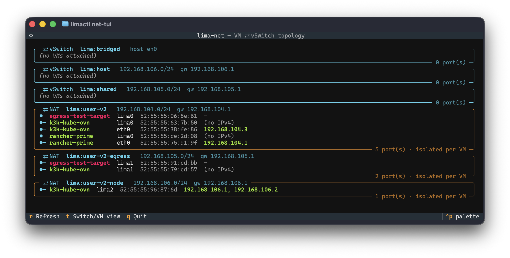
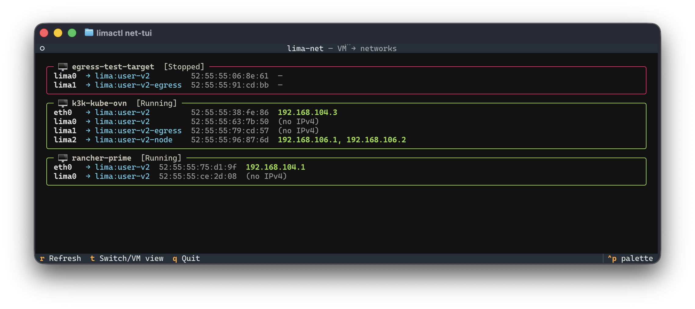

# lima-net

A small [Textual](https://textual.textualize.io/) TUI, packaged as a
[Lima](https://github.com/lima-vm/lima) **CLI plugin** (`limactl-net-tui`), that
draws which Lima VM is wired to which network (vSwitch), on which NIC, with
which IP. Once installed on `PATH`, run it as `limactl net-tui`.

Lima keeps the *configured* networks (name + MAC + interface) on the host, but
the IPs are handed out by DHCP **inside** the guest, so no single command joins
the two. `lima-net` correlates them — by MAC, then interface name, then IP
subnet — and renders one panel per network.

### vSwitch View (default)


### VM View (toggled with `t`)


## Install as a Lima plugin

Make `limactl-net-tui` executable and copy it to a directory on your `PATH` (e.g., `~/.local/bin/`):

```sh
chmod +x limactl-net-tui
cp limactl-net-tui ~/.local/bin/
```

**Requirements:**
- **Lima >= 2.0**
- [**`uv`**](https://docs.astral.sh/uv/) on `PATH` (resolves Python dependencies automatically on the first run via its inline PEP 723 metadata)

## Run

```sh
limactl net-tui                  # as a plugin
limactl net-tui --demo           # canned data, no Lima needed
./limactl-net-tui --demo         # direct execution (uv shebang bootstraps deps)
uv run limactl-net-tui --demo    # explicit
```

### Keys

| key | action                         |
|-----|--------------------------------|
| `r` | refresh                        |
| `t` | toggle vSwitch ⇄ VM view       |
| `q` | quit                           |

### Flags

| flag           | effect                                                       |
|----------------|--------------------------------------------------------------|
| `--demo`       | use canned data, no Lima required                            |
| `--print`      | render once to stdout and exit (no TUI; good for cheatsheets)|
| `--by-vm`      | start in VM-centric view                                     |
| `--all-ifaces` | do **not** filter CNI/virtual interfaces (debug)             |
| `--dump`       | diagnostic: print each VM's configured `network[]` + guest NICs, then exit |
| `--lima-home`  | override `LIMA_HOME` for network lookup                      |

If a VM's NICs land in the wrong panel, run `--dump` first — it shows exactly
what `limactl list --json` reports for that VM versus what the guest reports,
which is where any mismatch will be visible.

## How it works

Two sides, joined per VM:

- **Networks (the vSwitches).** Pulled from `limactl network list` zipped with
  `limactl network list --json`. The names come from the table, the details
  from JSON — see *Known upstream issues* below. Every defined network is shown,
  including ones with no VM attached, so the picture is complete.
- **Live NICs + IPs.** From `limactl shell <vm> -- ip -d -j addr show`, run per
  running instance.

Each guest NIC is matched to a network in priority order:

1. **MAC** against the VM's configured `network[]` (authoritative).
2. **Interface name** against `network[]` — this is what lets `lima1` resolve to
   the right network even when it has *no IPv4 yet*.
3. **IP subnet** against the known network CIDRs — a best-effort fallback for
   NICs not in the config (e.g. an `eth0` reassigned to a named user-v2 net).
4. Otherwise the NIC is the implicit usermode NAT (`192.168.5.x`), shown as a
   per-VM NAT panel rather than a shared bus, because slirp NAT is isolated per
   VM.

### CNI noise is filtered out

On a Kubernetes node the guest reports a pile of virtual interfaces — `cni0`,
`flannel.1`, `cilium_*`/`cali*`, `veth*`, `kube-ipvs0`, `ovn0`, `docker0`.
`lima-net` keeps only **real** NICs: `link_type == ether`, not loopback, and
**no `info_kind`** in `ip -d` detail. Every CNI/overlay device is a
`veth`/`bridge`/`vxlan`/`geneve`/`dummy` and carries an `info_kind`, so it's
dropped structurally rather than by a name blocklist. Use `--all-ifaces` to see
everything (debugging).

## Known upstream issues (worked around)

Both issues are tracked upstream in [lima-vm/lima#5178](https://github.com/lima-vm/lima/issues/5178).

**1. `network list --json` drops the name.** The name is the map key in limactl
and never lands in the marshalled object, so JSON rows are anonymous while the
plain table still prints `NAME`. This matters when networks differ only by name
(e.g. `user-v2`, `user-v2-egress`, `user-v2-node`). `lima-net` zips the table's
names onto the JSON rows positionally — both branches iterate the same sorted
slice, so they line up. Cause: `cmd/limactl/network.go` marshals the value
struct without the key.

**2. `list --json` uses the singular key `network`.** The per-instance networks
array is emitted under `network`, not `networks` (the `Instance` struct tags it
`json:"network"`), even though the on-disk `lima.yaml` uses plural `networks`.
Reading the wrong key makes *every* NIC fall through to the default-NAT bucket.
`lima-net` reads `network`, then `networks`, then nested `config.networks`, and
finally the on-disk `lima.yaml` (via the instance's `dir`) as a fallback.

## Caveats

- **Overlapping subnets need the config.** If two networks share a CIDR (e.g.
  `shared` and `user-v2-egress` both on `192.168.105.0/24`, or `host` and
  `user-v2-node` both on `192.168.106.0/24`), IP-subnet matching alone is
  ambiguous — only the MAC/interface match against the VM's `network[]`
  disambiguates them. If that config list is missing for a VM, an
  overlapping-subnet NIC may be attributed to the wrong network; `--dump` will
  reveal whether the config is present.
- The `info_kind` filter assumes you don't want to *see* an intentional virtual
  NIC in the guest (a hand-made VLAN or bond). Unusual for Lima; `--all-ifaces`
  brings them back.
- IPv6 is not shown (IPv4 only). Easy to add.
- Schema parsing targets the current limactl output. If a field moves, the blast
  radius is `merge_network_list`, `parse_networks_yaml`, and `_instance_networks`.
